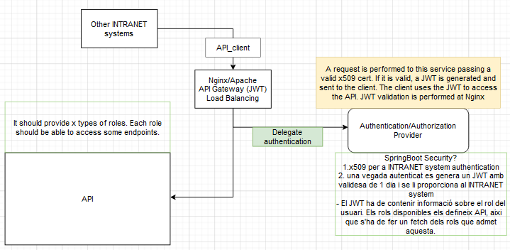

_# API GATEWAY Authentication

Add an extra layer of security for INTRANET apps to authenticate and consume a service hosted behind an api gateway that uses this service to authenticate its clients. It does so by generating JWTs after successful x509 authentication.




## TODO
- afegir opcio de proporcionar sessionID o JWT.
  - Si s'utilitza JWT 
    - els rols del user autenticat son visibles
    - és més ràpid ja que només es valida el JWT i no s'han de fer queries a la BD per a autenticar
  - Si s'utilitza sessionID
    - es fa un fetch dels rols del user per cada request
    - es fa un fetch del sessionID a la BD per cada request
    - possibles CSRF ?
    - més adient per a autenticar external users ja que no exposem rols
  - També podem utilitzar JWT i fer el fetch dels rols a la BBDD enlloc d'utilitzar sessionID

- per a manejar la auth al userDetailsService
  - podem Utilitzar la implementació de AuthorizationService per a autenticar l'usuari i obtenir els rols
  - després podem passar el username i rols al controller per a que generi el JWT~~~~

- admin controller
  - to create new users and manage their roles
  - to create new roles and activate/deactivate roles (add active property to roles table)

- automatic JWT secret regeneration
  - if nginx is performing jwt validation then we need to inform nginx of the new JWT secret
  - nginx needs to be able to perform jwt validation based on two simultaneously valid secrets
  - another option would be to have clients reauthenticate to obtain a new x509 when a new secret is generated 
    - take into account that this will introduce peaks of clients trying to authenticate when a secret is invalidated (performance might decrease)
  
- docker 
  - mysql
    - Dockerfile 
    - configuration file
    - script to generate db/tables, insert dummy data and generate dummy certificates
  - nginx config
    - configuration file


<br><br>

# TLS configuration

- The application performs TLS mutual authentication
- The client that wishes to be authenticated must present a valid certificate trusted by the server
- The server then performs checks if the CN present in the client certificate is known by the server

To accomplish this we need to generate a root certificate that will be trusted by the applications that need to be authenticated. The root CA will sign both the client cert and the server cert. The CN specified in the client cert must be registered as a valid CN by the server.

The steps are detailed [here](docs/tls_configuration.md)

<br><br>

## DB setup
- set up mysql
```shell
docker run --rm --network api_gw-network --name mysql -e MYSQL_ROOT_PASSWORD=root -d mysql:8.0.33
```
- connecting to the db
```sh
docker run -it --network api_gw-network --rm mysql mysql -hmysql -uroot -p
```
<br>

TABLE Clients: id PK, name

TABLE Roles: role PK

TABLE Client_roles: id PK FK, role PK FK

<br>

CREATE TABLE clients(
  id INT, 
  name VARCHAR(10) NOT NULL,
  PRIMARY KEY(id)
);

CREATE TABLE roles(
  role VARCHAR(10),
  PRIMARY KEY(role)
);

CREATE TABLE client_roles(
  client_id INT,
  role VARCHAR(10),
  PRIMARY KEY(client_id, role),
  FOREIGN KEY (client_id) REFERENCES clients(id),
  FOREIGN KEY (role) REFERENCES roles(role)
);

<br>

SELECT clients.name,client_roles.role FROM clients INNER JOIN client_roles ON clients.id=client_roles.client_id WHERE clients.name =?
